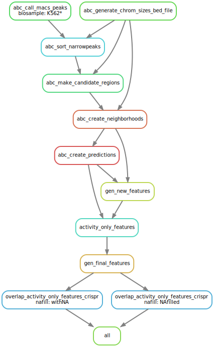

# Description

This folder is an archive of https://github.com/EngreitzLab/ENCODE_rE2G frozen at commit 5069df668fd4958291a412d5276ef86916c67277 (14/12/2023)
  - The original repo also used https://github.com/broadinstitute/ABC-Enhancer-Gene-Prediction/ as a submodule. We have it setup as a plain archive frozen at commit cb230435986d8c73f163c8d29b69fa438da82338

This folder calculates the ABC score and overlaps it with a given reference .tsv of candidate EPI pairs. At the momement (Jan 2024), the original repo is currently under development which is why I have copied an archive at this point in time as a bandaid for our purposes so upstream changes don't affect us. When the original repo is stable, we'll have to go migrate this.

# Changes
The upstream repository handles a superset of tasks that we seek to do and some of our input files are slightly different to theirs. So this archive will include some small plumbing changes that are detailed below
  1. H3K27ac support
     - The upstream repository as it stands has extra functionality for testing out a predictive model for EPI as well. However as it stands, that functionality does not support H3K27ac. Throws error if a H3K27ac path is deteced in the H3K27ac column of ./config/config_biosamples_chr22.tsv. (See ./workflow/rules/utils.smk line 29), This is despite the fact that we may want to use H3K27ac only for the calculation of ABC score only which the ABC submodule does support. We make the following modifications
       - Comment out exception throwing code in .workflow/rules/utils.smk (line 29)
       - Add in H3K27ac file path in ./config/config_biosamples_chr22.tsv
  2. Commenting/Uncommenting workflows used in ./workflow/Snakefile
     - Comment out to disable functionality for running and evaluating model
     - Uncomment in to enable functionality for producing ABC score and features for candidate EPI pairs instead
  3. Substituting in preprocessed EPCrisprBenchmark data instead of provided EPCrisprBenchmark data
     - cp ../encode_e2g_original_dataset/for_ENCODE_rE2G/EPCrisprBenchmark_ensemble_data_reference.tsv ./reference/
     - corrresponding edit to ./config/config.yaml in the `crispr_dataset` field
     - The files are more or less the same. See ../encode_e2g_original_dataset/preprocess for transformations done. Apart from those, I think the two files are also sorted differently (e.g. lexical sort vs numerical) 
  4. Modify ./workflow/scripts/overlap_features_with_crispr_data.R
     - Line 87 of this script removes columns containing "merged_..." e.g. merged_uid, merged_start, merged_end from the EPCrisprBenchmark reference file. But our version doesn't have that anyway so it throws a runtime error something along the lines of column not found
     - So we just comment out that line 

# Tour of the Repo
* ABC
  * ... # ABC-Enhancer-Gene-Prediction submodule
* config 
  * config.yaml 
  * config_biosamples.tsv
  * config_biosamples_chr22.tsv 
* data
  * download.sh
* models
  * ... # not relevant for our purpose
* reference
* results
  * K562
  * K562_chr22
  * tmp # temporary output files
* workflow
  * envs
    * encode_re2g.yml
  * rules
    * activity_only_features.smk
    * gen_new_features.smk
    * overlap_crispr.smk
    * predictions.smk
    * qc.smk
    * utils.smk
  * scripts
    * activity_only_features.R
    * gen_new_features.py
    * generate_plots.py
    * get_fill_values.R
    * get_stats.py
    * overlap_features_with_crispr_data.R
    * run_e2g.py
    * threshold_e2g_predictions.py
  * Snakefile
* original_README.md # This was the README.md file from the upstream repo. I've renamed it. It targets a slightly different usecase.
* overall_env.yml 

Snakemake provides a neat way to visualise the workflow and how everything fits together
```
snakemake --dag -F | dot -Tsvg > workflow_dag.svg
```


# Usage
`./config/` is where most of your changes will be. `./data/` is a suggested place to put your input data e.g. H3K27ac and DNAse .bam files and .hic files, however the location does not matter too much because you can link any location on your machine inside the `./config/config_biosamples` TSV file
  * To process a new dataset, create a new .tsv file in `./config/`. 
    * The following fields are required: "biosample	DHS	ATAC	H3K27ac	default_accessibility_feature	HiC_file	HiC_type	HiC_resolution	alt_TSS	alt_genes"
      * $biosample is just a label for your dataset. The output will be enclosed in a folder by the name of $biosample
      * $DHS is the location of your DNase datafile e.g. `.bam` (I think tagAlign files are also supported but I'm not too sure).
      * $ATAC is the location of your ATAC datafile. However it is optional choice between using DHS or ATAC. This choice MUST to be specified in $default_accessibility_feature
      * $H3K27ac is the location of your H3K27ac datafile. This is strictly optional. In the case you include H3K27ac, the ABC score will be generated using the Geometric mean of DHS or ATAC and H3K27ac
      * $default_accessibility_feature is either "DHS" or "ATAC"
      * $HiC_file is the location of your HiC dataset e.g. `.hic`. It can also be an ENCODE download link to a .hic file. According to the ABC paper (Fulco, 2019), an organism biosample averaged HiC gives comparable performance against cell type specific HiC. Multiple file formats are supported (I think based on ./ABC/workflow/scripts/hic.py line 9) e.g. juicebox output folder (containing {KR,VC}observed and norm), bedpe, etc. File format specified in $HiC_type
      * $HiC_type is the file format for the HiC input e.g. "hic", "bedpe", "juicebox"
      * $alt_TSS is the location of an alternate gene TSS list as a .bed file in bed6 format. This is an optional field. If left empty it uses the default of `./reference/RefSeqCurated.170308.bed.CollapsedGeneBounds.hg38.TSS500bp.bed`. Only fill this value if you have your own TSS gene file you want to supply e.g. if using on different organism like mouse or using on a subset of chromosomes (although I think for this case using the default would still work) or using on a different genome assembly (by default this provides for GRCh38.
      * $alt_genes is the location of an alternate gene bounds (I think). Similar to above? Also optional. For virtually all cases leave the $alt_TSS and $alt_genes empty
  * Next produce a TSV file of candidate EPI you want to test
    * The following fields are required "chrom	chromStart	chromEnd	chrTSS	startTSS	endTSS". Other fields (I think) are optional. # TODO: will need to test it out when running workflow on in house dataset
  * Finally modify the `./config/config.yaml` file 
    * Enter in the location of your config_biosamples TSV file into $ABC_BIOSAMPLES
    * Enter in the location of your candidate-EPI dataset into $crispr_dataset
    * Optionally enter an alternate output directory in $results_dir
Now create a mamba (or conda but mamba is prefered) environment using `overall_env.yml`. The upstream repo has it's own .yml files defined in `./workflow/envs` and `./ABC/workflow/envs` and I think those environments are meant to be activated by the Snakemake in each rule defining a conda. However, I found it easier for myself to just shove all the dependencies into one `overall_env.yml` and just use that for the whole process.  
  * E.g.
```
$ micromamba env create -f overall_env.yml
$ micromamba activate encode_e2g_features_overall_1
```
Running the workflow
  * With this setup, use the `snakemake` command e.g.  run `$ snakemake -n` for a dry run to check everything works e.g. run `$ snakemake -p --cores 12` to run the workflow using 12 cores. 


